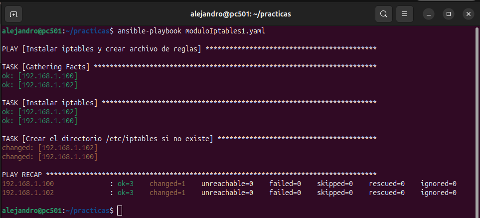
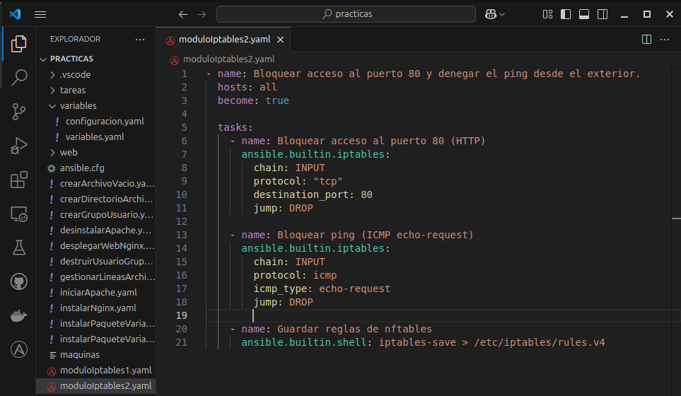
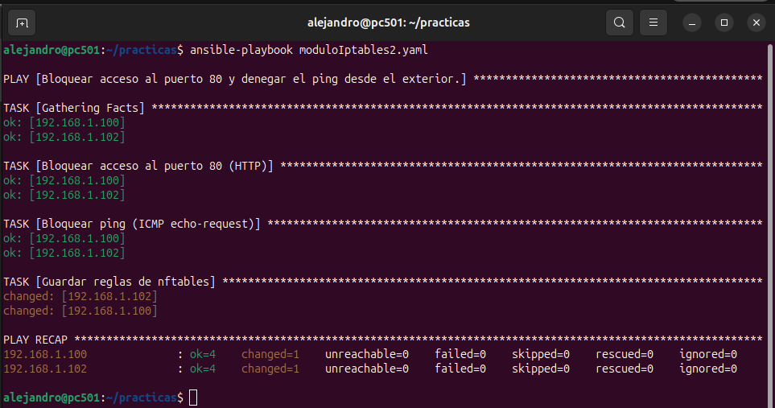
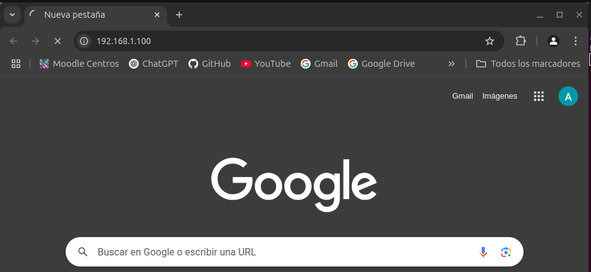
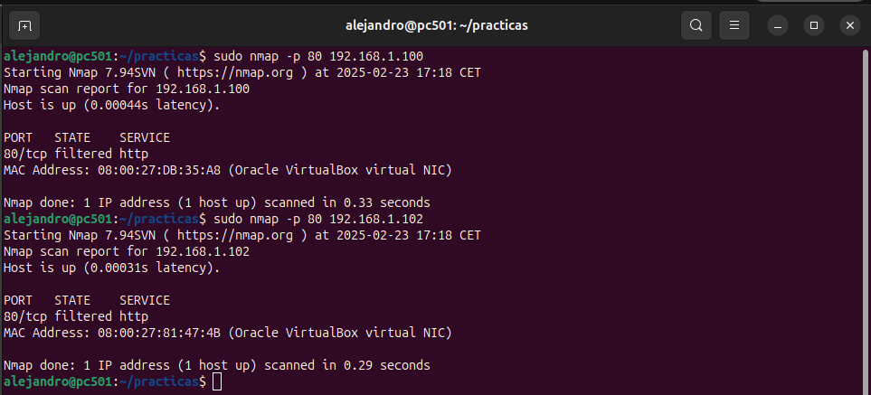
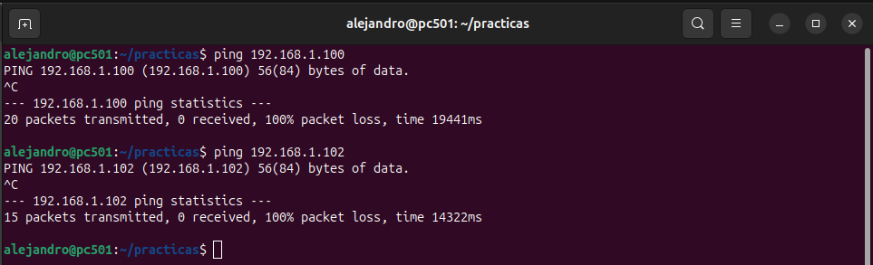
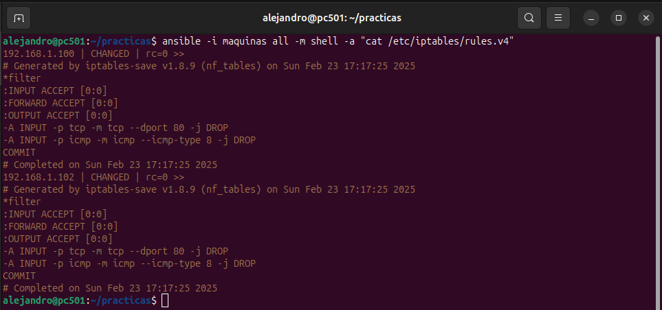

# FUNCIONAMIENTO DEL MÓDULO

## PREPARACIÓN DEL ENTORNO

> Elaboraremos este [playbook](moduloIptables1.yaml) que nos instalará iptables y creará su archivo de reglas en nuestros servidores.

### EJECUCIÓN DEL PLAYBOOK

## EJEMPLO 1 y EJEMPLO 2:
> En esta práctica vamos a añadirle una capa de seguridad a nuestros servidores de Hanoi y Santorini protegiendo el puerto 80 y denegar las respuestas al protocolo ICMP.

### PASO 1:
> Comprobar que el puerto 80 funciona accediendo a la página web alojada en nuestro servidor.

### PASO 2:
> Elaboramos este [playbook](moduloIptables2.yaml) que añadirás las reglas necesarias al fichero de iptables en ambos servidores.

### PASO 3:
> Ejecutamos el playbook y comprobamos que todo ha salido correctamente.

## COMPROBACIONES:
> Ahora haremos pequeñas comprobaciones para ver que todo haya ido bien y las reglas se hayan aplicado correctamente.

### PRIMERA COMPROBACIÓN:
> Vemos que a través del navegador no nos deja acceder a la página web a través del puerto 80 (http).

### SEGUNDA COMPROBACIÓN:
> Otra comprobación para el puerto 80 es haciendole un nmap a dicho puerto de ambas máquinas que se encuentran en nuestra misma red porque esto es un entorno de pruebas.

### TERCERA COMPROBACIÓN:
> En esta comprobación del protocolo ICMP, haremos ping a ambas máquinas.

### CUARTA COMPROBACIÓN:
> Como última comprobación imprimiremos por pantalla el contenido del fichero de reglas iptables de ambos servidores

