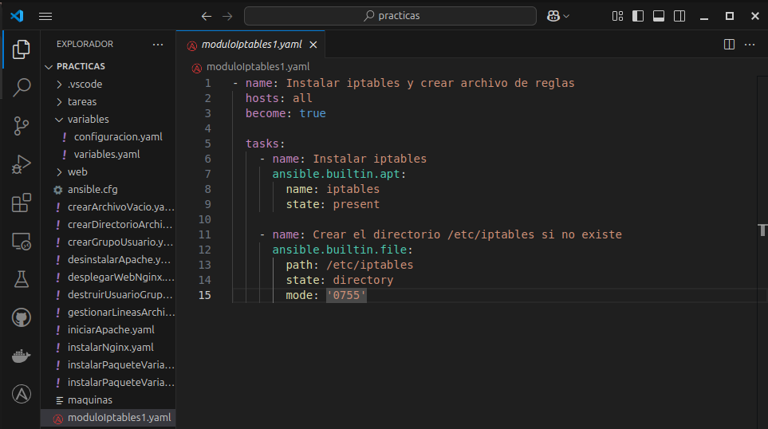

# FUNCIONAMIENTO DEL MÓDULO

## PREPARACIÓN DEL ENTORNO
### PASO 1:
> Elaboraremos este [playbook](https://raw.githubusercontent.com/alemonterx/ansible/refs/heads/main/moduloIptables1.yaml) que nos instalará iptables y creará su archivo de reglas en nuestros servidores.

